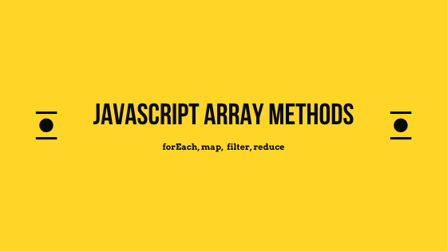

We all know that arrays are technically objects when it comes to JavaScript, and, like an object, an array too has methods in its protoype (_proto_ to be precise). <b>ForEach, Map, Filter and Reduce</b> are one of the most useful methods out there, making our code a lot clearer and easier to write.

### **Array.prototype.forEach()**

Let’s take an example to understand forEach() better.

```javascript
var array = [1, 2, 5, 6, 7];

array.forEach(function cb(currentValue, index, array) {
  console.log(currentValue);
});

Output: 1 2 5 6 7

```
<br>

In simple words, what forEach() is doing, it sits on top of the array, throws each element of the array one by one to the callback function, and our function cb performs the required action i.e., logging the current value. You could also say that forEach converts the data (of an array ofc) into a <b>stream of data</b>, further giving it to the callback function.


A <b>callback function</b> is a function that is passed as an argument to another function, to be “called -back” at a later time. It executes on <b>each element of the array</b>. A callback generally takes:

<br>

<i><b>currentValue</b></i>

It is the current element of the array being processed at the time. For example, in our array, <b>1</b> is the currentValue in the first iteration, <b>2</b> in the second iteration and so on.

It is important to note that forEach() doesn’t return anything, meaning it returns <b>undefined</b>. Also, it runs the whole length of the array, unlike a for-loop.

<br>

<i><b>index</b></i>

It is the index of the current element being processed in the array. In our example, value of index for the first element is 0 (because 1 is at index 0).

<br>

<i><b>array</b></i>

The same array, forEach() was called upon i.e., [1, 2, 5, 6, 7].

<br>

### **Array.prototype.map()**

If you need a new array having <b>same size</b> as that of the original array, <b>map()</b> would be your best choice.

```javascript
var array = [1, 2, 5, 6, 7];

array.map(function cb(currentValue, index, array) {
  return currentValue * 2;
}

Output: [4, 8, 12, 14, 20]
```
<br>

Here, coming to our previously used analogy, <b>map()</b> is sending a stream of data to <b>cb</b> and it’s multiplying the currentValue by 2, finally returning a new array.

So, map() returns a new array of the same size. Cool!


### **Array.prototype.filter()**

Imagine, if you wanted to select some fruits (say apples) from a huge basket of fruits mixed up together, what would you do ? Pick up a smaller new basket, grab the apples and put them inside it. That’s how we filter items, right ?

```javascript
var array = [1, 2, 5, 6, 7];

array.filter(function cb(currentValue, index, array) {
  return currentValue % 2 === 0;
});

Output: [2, 6]
```
<br>

Here, as you would’ve comprehended, filter() is filtering out even items from the given array and storing the items inside a new array. This is how it works!

So, our filter() methods operates on an array and returns a new array of same size or less.


### **Array.prototype.reduce()**

Now, here comes the “seems to be tricky ” kind of an array method, but I would rather call it an useful and most powerful among all the methods discussed here. You’ll find out why :)

So, here’s the thing about reduce(), it takes an array as an input, returns a single output value; it could be anything, from an integer to an object, array or something else. Besides, the callback function is taking four arguments now, the newer one is the <b>accumulator</b>.

Accumulator is nothing but a temp variable that accumulates or stores the callback’s return values. Doesn’t make sense right ? Don’t worry, it will.

If no initialValue is provided to the accumulator:

```
accumulator = first value in the array
currentValue = second value in the array
```
<br>

If initialValue is provided to the accumulator:


```
accumulator = initialValue
currentValue = first value in the array
```
<br>

<b>It is important to note here that index starts from 0 if an initalValue is provided. Otherwise, index starts from 1.</b>

Consider this example:

```javascript
var array = [1, 2, 5, 6, 7];

array.reduce(function cb(accumulator, currentValue, index, array) {
  accumulator = accumulator + currentValue;
  return accumulator;

});
Output: 21
```
<br>

This table might help you understand better.


<style>
	.demo {
		border:1px solid #C0C0C0;
		border-collapse:collapse;
		padding:5px;
	}
	.demo th {
		border:1px solid #C0C0C0;
		padding:5px;
		background:#F0F0F0;
	}
	.demo td {
		border:1px solid #C0C0C0;
		padding:5px;
	}
</style>
<table class="demo">
	<caption></caption>
	<thead>
	<tr>
		<th>callback </th>
		<th>accumulator</th>
		<th>currentValue</th>
		<th>currentIndex</th>
		<th>return value</th>
	</tr>
	</thead>
	<tbody>
	<tr>
		<td>first call</td>
		<td>1</td>
		<td>2</td>
		<td>1</td>
		<td>3</td>
	</tr>
	<tr>
		<td>second call</td>
		<td>3</td>
		<td>5</td>
		<td>2</td>
		<td>8</td>
	</tr>
	<tr>
		<td>third call</td>
		<td>8</td>
		<td>6</td>
		<td>3</td>
		<td>14</td>
	</tr>
	<tr>
		<td>fourth call</td>
		<td>14</td>
		<td>7</td>
		<td>4</td>
		<td>21</td>
	</tr>
	</tbody>
</table>


