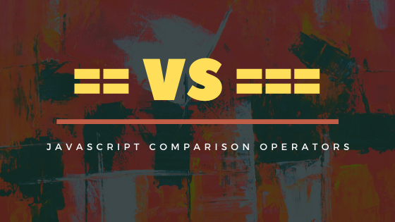

You might've come across <b>double and triple equality</b> operators in JavaScript, plus things like type conversion or type coercion. All of it might seem confusing at first, though a better understanding will help you look things in a more vivid manner.

These operators lie in the category of <b>comparison operators</b> and are used for testing equality of operands, resulting in either true or false value.

<br>

### **Triple Equals (===)**

When using triple equals in JavaScript, one important thing to keep in mind is that it doesn't do type coercion. Umm, what? Well, it just doesn't change the type of one operand to match the type of the other operand. Let's see this with an example.

```
23 === "23" // False

```
<br>

The above condition results in false because 23 is of <b>number</b> data type while "23" is a <b>string</b>. So, they can't be equal. It's important to note that what we're checking here is something called, a strict equality.

```
23 === 23 // True

```
<br>

This is self-explanatory. Both are numbers, and both have the same value, so there's no reason they can't be equal.

<br>

### **Double Equals (===)**

This comparison operator checks for equality while performing type coercion.

<i>According to stack overflow, " <b>Type coercion means that when the operands of an operator are different types, one of them will be converted to an "equivalent" value of the other operand's type"</b>.</i>

<br>

Let's look at this simple example:

```
23 == "23" // True

```
<br>

Here, double equals checks the equality between a number and a string. Unlike triple equals, it won't return us a false value. Why ?

It converts one of them values, for example, it might convert the number into a string or the string into number. But the thing is, after using ==, both the values will have the same data type. That's why the result turned out to be true.

Some other examples to look at:

```
"Hello" == "Hello" // True (Both strings, same values)

"Hello" == "Hello1" // False (Both strings, different values)

```
<br>

### Summary**

=== simply returns true if the operands are strictly equal (no type coercion).

== returns true if the operands are of same data type (if not, == will convert them into the same data type) and have the same value.